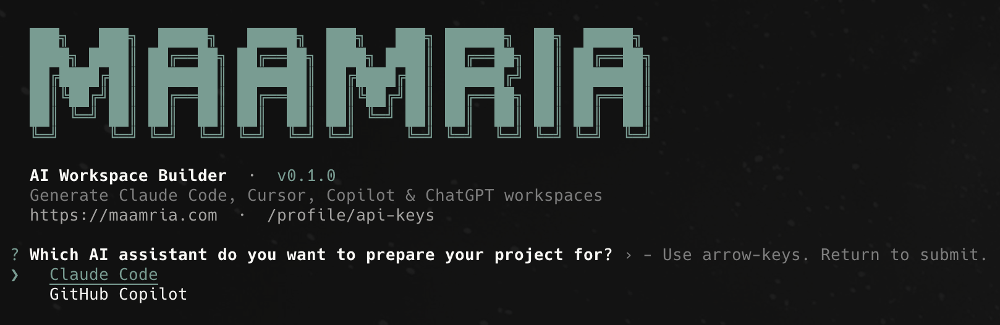

# Maamria-AWB — AI Context Builder for Claude Code, Copilot, Cursor & ChatGPT Projects

> **By [Maamria AI Workspace Builder](https://maamria.com).** Generate a clean, AI-ready workspace — `CLAUDE.md`, `.claude/agents`, `.claude/skills`, slash commands, assistant rules — for any project, in seconds, from your terminal.

> 🌐 **Prefer the browser?** You can also build the same workspace online at **[https://maamria.com/tools/ai-workspace-builder](https://maamria.com/tools/ai-workspace-builder)** — no CLI required. Step through the wizard, download the generated `.zip`, and copy the files into your project.

[](https://www.npmjs.com/package/@maamria/awb)
[](./LICENSE)
[](https://nodejs.org)
[](#roadmap)
[](./CONTRIBUTING.md)

```bash
npm install -g @maamria/awb
maamria-awb login
maamria-awb init
```

<p align="center">
  
  <br />
  <sub><em>The interactive <code>maamria-awb init</code> wizard — pick your assistant, project type, tech stack, rules, agents, and skills, then watch the workspace files land in your project.</em></sub>
</p>

---

## Why this exists

Most developers start using **Claude Code, GitHub Copilot, Cursor, Windsurf, or ChatGPT Projects** without giving the assistant enough project context. The AI then:

- reads files it shouldn't,
- misunderstands the architecture,
- burns tokens scanning vendored code and build artefacts,
- modifies the wrong things,
- contradicts decisions made last week.

`maamria-awb` solves this by generating a **clean AI-ready workspace** — context files, rules, agents, skills, and slash commands — *before* the assistant starts working. You get faster, cheaper, more predictable AI-assisted development.

## What the CLI generates

When you run `maamria-awb init`, the wizard collects:

- **Assistant** — Claude Code, GitHub Copilot, Cursor, Windsurf, ChatGPT Project (Claude Code is the mature output today; others on the [roadmap](./ROADMAP.md)).
- **Project type & tech stack** — searched live against the Maamria AI catalog.
- **Behavior mode** — Safe / Startup / Enterprise.
- **Rules, agents, skills, slash commands** — multi-select from the catalog.
- **Project name, description, language.**

It then writes the files into your project directory. Today's Claude Code output looks like:

```
your-project/
├── CLAUDE.md                          # canonical instructions for the assistant
├── SOURCES.md                         # references and curated reading list
├── .claude/
│   ├── settings.json                  # context-protection denies, env defaults
│   ├── agents/<agent>.md              # one file per selected agent
│   ├── skills/<skill>/SKILL.md        # one folder per selected skill
│   ├── commands/<command>.md          # one file per slash command
│   └── rules/<rule>.md                # behaviour-mode rules
└── .maamria-backups/<timestamp>/      # any files we replaced (only if conflicts)
```

The wizard never writes outside the project root. Existing files prompt you to **overwrite / skip / backup** before being touched.

## Without vs. with `maamria-awb`

| 🔴 Without Maamria-AWB | ✅ With Maamria-AWB |
|---|---|
| 🔴 AI assistant starts without clear project context | ✅ AI assistant receives structured project context before coding |
| 🔴 More token waste because the assistant scans unnecessary files | ✅ Less token waste — the assistant knows what matters |
| 🔴 Higher risk of modifying the wrong files | ✅ Project rules and boundaries protect the codebase |
| 🔴 Inconsistent coding style across AI sessions | ✅ Consistent instructions, rules, and workflows |
| 🔴 Manual setup for `CLAUDE.md`, agents, skills, commands | ✅ Automatic generation from one CLI workflow |
| 🔴 Harder onboarding for new contributors | ✅ Documented project structure ready on day one |
| 🔴 AI may ignore architecture decisions | ✅ Architecture and constraints are written clearly |
| 🔴 Repeated explanations in every AI session | ✅ Reusable context files live inside the project |
| 🔴 Messy or incomplete assistant instructions | ✅ Clean, structured, AI-ready workspace |
| 🔴 Less control over AI coding behavior | ✅ Predictable AI-assisted development |

## Benefits at a glance

- **Save setup time** — one wizard, dozens of files generated.
- **Reduce token usage** — context-protection denies rule out vendored / built code.
- **Avoid irrelevant file scanning** — the assistant skips what doesn't help.
- **Improve AI code quality** — clearer rules, fewer surprises.
- **Standardise AI instructions across a team** — one workspace, shared by everyone.
- **Make Claude Code, Copilot & Cursor more project-aware** — they read your project's intent, not just its bytes.
- **Reduce repeated explanations** — what you'd say at the start of every session is already in the files.
- **Easier onboarding** — new contributors get a documented baseline.
- **Safer AI-assisted development** — backups, path-traversal rejection, clear conflict prompts.
- **Open source** — MIT-licensed, contributions welcome.

## Installation

```bash
npm install -g @maamria/awb
# or
pnpm add -g @maamria/awb
```

Verify:

```bash
maamria-awb --version
```

If `command not found` after install, see [`docs/global-install.md`](./docs/global-install.md) for `npm link`, PATH, alias, and Homebrew options (zsh + bash).

## Usage

### 1. Create an API key on the Maamria AI dashboard

Log in at <https://maamria.com>, open **Profile → API Keys**, and click **New API Key**. Copy the key once — you won't see it again.

### 2. Connect the CLI

```bash
maamria-awb login
# paste your key when prompted (input is hidden)
```

The key is stored at the OS user-config path (e.g. `~/Library/Preferences/maamria-ai/config.json` on macOS) — **never** inside your project directory.

### 3. Generate a workspace

```bash
cd ~/projects/my-app
maamria-awb init
```

The wizard walks you through assistant → project type → tech stack → mode → rules → agents → skills → commands → details → confirm. Files land in the current directory.

### 4. Other commands

```bash
maamria-awb status         # who am I logged in as?
maamria-awb config         # show API URL + config file path
maamria-awb logout         # remove the saved key from this machine
maamria-awb generate       # alias for init
```

Every command supports `--help`.

## Local development mode

Working on the CLI itself, or testing against your local backend?

```bash
git clone https://github.com/maamria/awb.git maamria-awb
cd maamria-awb
npm install

# point at the local backend (the CLI never auto-prefixes /v1)
export MAAMRIA_API_URL=http://127.0.0.1:8010/v1

./bin/dev.sh login
./bin/dev.sh init
```

`bin/dev.sh` runs the TypeScript source through `tsx` — no build step needed. Full guide: [`docs/dev-setup.md`](./docs/dev-setup.md).

## Configuration

| Setting | Default | Override |
|---|---|---|
| API base URL | _placeholder — see below_ | `MAAMRIA_API_URL` env var, or `maamria-awb config --set apiUrl <url>` |
| API key | (from `login`) | `MAAMRIA_API_KEY` env var, or `--api-key <key>` flag |

The base URL is treated as the **single source of truth** — the CLI does **not** add `/v1` itself.

> **Heads-up:** the compiled-in default URL is a placeholder for a future hosted endpoint that is **not deployed yet**. Until the public production proxy ships, point the CLI directly at the FastAPI backend you can reach. For the open-source backend in this repo that means:
>
> ```bash
> # local backend on port 8010
> export MAAMRIA_API_URL=http://127.0.0.1:8010/v1
>
> # or whichever URL your team has deployed the FastAPI app at — include /v1
> maamria-awb config --set apiUrl https://your-deploy.example.com/v1
> ```
>
> The CLI will follow whatever you set; nothing in `@maamria/awb` is hard-locked to `maamria.com`. Details and full mode walk-through in [`docs/config.md`](./docs/config.md).

## Security

- Raw API keys are **hashed (SHA-256)** before being stored on the server. The server never has the plaintext key after creation.
- The CLI **never prints the full key** after login (status shows only `maamria_sk_aB3kQp••••T230`).
- Keys travel in `Authorization: Bearer <key>` — never in request bodies, never in URLs.
- Generated workspace files **never** contain your API key.
- Revoking a key from the dashboard **immediately** invalidates it on the next CLI request.
- Generated paths are validated server-side **and** client-side against `..`, absolute paths, drive letters, NUL bytes — the CLI refuses to write outside the project root.

Threat model and full key lifecycle in [`SECURITY.md`](./SECURITY.md) and [`docs/security.md`](./docs/security.md).

## Documentation

- [`docs/dev-setup.md`](./docs/dev-setup.md) — run locally without publishing.
- [`docs/global-install.md`](./docs/global-install.md) — make `maamria-awb` callable in every shell.
- [`docs/architecture.md`](./docs/architecture.md) — package layout, design choices.
- [`docs/commands.md`](./docs/commands.md) — every command, every flag.
- [`docs/api-contract.md`](./docs/api-contract.md) — backend ↔ CLI HTTP contract.
- [`docs/config.md`](./docs/config.md) — config file paths, env vars, modes.
- [`docs/security.md`](./docs/security.md) — threat model, key lifecycle.
- [`docs/troubleshooting.md`](./docs/troubleshooting.md) — symptom → fix table.
- [`docs/deploy/`](./docs/deploy/README.md) — publishing to npm, pnpm, Homebrew.
- [`docs/open-source-growth.md`](./docs/open-source-growth.md) — how to help the project grow.

## Roadmap

A high-level overview lives in [`ROADMAP.md`](./ROADMAP.md). Highlights:

- **Phase 1 (current)** — Stable CLI: login, init, status, logout, config; secure local storage; API-key auth.
- **Phase 2 (in progress)** — Full assistant-specific outputs: GitHub Copilot, Cursor, Windsurf, ChatGPT Project. (Claude Code shipped today.)
- **Phase 3** — Team workflow: shared workspace templates, team rules, reusable profiles.
- **Phase 4** — Advanced generation: custom agents/skills, project-specific workflows, backend-recommended presets.
- **Phase 5** — Ecosystem: Homebrew formula, framework integrations, community templates marketplace.

## Contributing

Pull requests, issues, and template contributions are welcome. Start with [`CONTRIBUTING.md`](./CONTRIBUTING.md) — it covers cloning, the dev loop, commit style, and the PR checklist. Beginners welcome.

Other useful entry points:

- [`CHANGELOG.md`](./CHANGELOG.md) — what changed in each release.
- [`CODE_OF_CONDUCT.md`](./CODE_OF_CONDUCT.md) — how we collaborate.
- [`SECURITY.md`](./SECURITY.md) — how to report a security issue privately.
- Issue templates: [bug report](./.github/ISSUE_TEMPLATE/bug_report.md) · [feature request](./.github/ISSUE_TEMPLATE/feature_request.md) · [docs improvement](./.github/ISSUE_TEMPLATE/documentation.md).

## License

MIT © [Maamria](https://maamria.com). See [`LICENSE`](./LICENSE).
